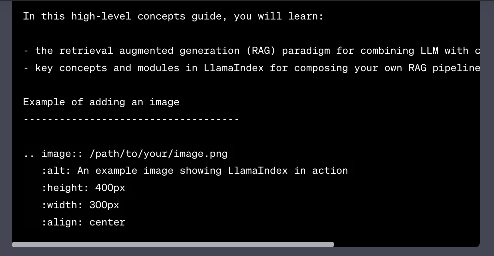

High-Level Concepts
===================

.. tip::

   If you haven’t, install and complete starter tutorial before you read this. It will make a lot more sense!

LlamaIndex helps you build LLM-powered applications (e.g. Q&A, chatbot, and agents) over custom data.

In this high-level concepts guide, you will learn:

- the retrieval augmented generation (RAG) paradigm for combining LLM with custom data,
- key concepts and modules in LlamaIndex for composing your own RAG pipeline.

Example of adding an image
------------------------------------

Retrieval Augmented Generation (RAG)
------------------------------------

Retrieval augmented generation (RAG) is a paradigm for augmenting LLM with custom data. It generally consists of two stages:

1. indexing stage: preparing a knowledge base, and
2. querying stage: retrieving relevant context from the knowledge to assist the LLM in responding to a question

LlamaIndex provides the essential toolkit for making both steps super easy. Let’s explore each stage in detail.

Indexing Stage
--------------

LlamaIndex helps you prepare the knowledge base with a suite of data connectors and indexes.

- **Data Connectors**: A data connector (i.e. Reader) ingests data from different data sources and data formats into a simple Document representation (text and simple metadata).
- **Documents / Nodes**: A Document is a generic container around any data source - for instance, a PDF, an API output, or retrieved data from a database. A Node is the atomic unit of data in LlamaIndex and represents a “chunk” of a source Document. It’s a rich representation that includes metadata and relationships (to other nodes) to enable accurate and expressive retrieval operations.
- **Data Indexes**: Once you’ve ingested your data, LlamaIndex will help you index the data into a format that’s easy to retrieve. Under the hood, LlamaIndex parses the raw documents into intermediate representations, calculates vector embeddings, and infers metadata. The most commonly used index is the VectorStoreIndex.

Querying Stage
--------------

In the querying stage, the RAG pipeline retrieves the most relevant context given a user query, and passes that to the LLM (along with the query) to synthesize a response. This gives the LLM up-to-date knowledge that is not in its original training data, (also reducing hallucination). The key challenge in the querying stage is retrieval, orchestration, and reasoning over (potentially many) knowledge bases.

LlamaIndex provides composable modules that help you build and integrate RAG pipelines for Q&A (query engine), chatbot (chat engine), or as part of an agent. These building blocks can be customized to reflect ranking preferences, as well as composed to reason over multiple knowledge bases in a structured way.

Building Blocks
---------------

- **Retrievers**: A retriever defines how to efficiently retrieve relevant context from a knowledge base (i.e. index) when given a query. The specific retrieval logic differs for different indices, the most popular being dense retrieval against a vector index.
- **Node Postprocessors**: A node postprocessor takes in a set of nodes, then applies transformation, filtering, or re-ranking logic to them.
- **Response Synthesizers**: A response synthesizer generates a response from an LLM, using a user query and a given set of retrieved text chunks.

Pipelines
---------

- **Query Engines**: A query engine is an end-to-end pipeline that allows you to ask a question over your data. It takes in a natural language query, and returns a response, along with reference context retrieved and passed to the LLM.
- **Chat Engines**: A chat engine is an end-to-end pipeline for having a conversation with your data (multiple back-and-forths instead of a single question & answer).
- **Agents**: An agent is an automated decision maker (powered by an LLM) that interacts with the world via a set of tools. An agent may be used in the same fashion as query engines or chat engines. The main distinction is that an agent dynamically decides the best sequence of actions, instead of following a predetermined logic. This gives it additional flexibility to tackle more complex tasks.

Next Steps
----------

- `tell me how to customize things. <link-to-customize-guide>`_
- curious about a specific module? Check out the `module guides <link-to-module-guides>`_
- have a use case in mind? Check out the `end-to-end tutorials <link-to-tutorials>`_

.. note::

   Make sure to replace placeholders like `<link-to-customize-guide>`, `<link-to-module-guides>`, and `<link-to-tutorials>` with the actual hyperlinks where needed.

Next
^^^^

Customization Tutorial

Previous
^^^^^^^^

Starter Tutorial

Copyright © 2022, Jerry Liu
Made with Sphinx and @pradyunsg's Furo
